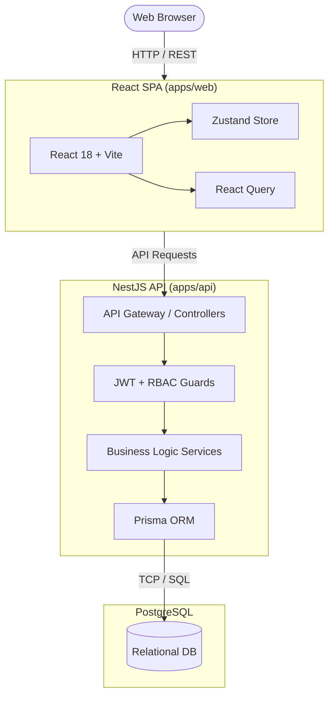
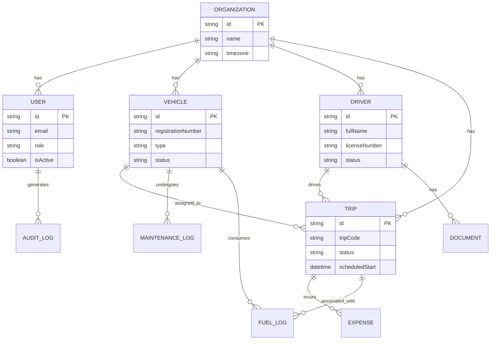

# FleetPilot

> **Command your fleet. Trust your data.**

FleetPilot is a modern, production-grade fleet operations platform. It digitizes vehicle management, driver dispatch, maintenance tracking, fuel and expense logging, and real-time operational analytics — all enforced through a strict role-based access control (RBAC) layer and business-rule validation pipeline.

## 🏗️ System Architecture

FleetPilot is designed as a modular Monorepo (powered by npm workspaces), running entirely in a local Node.js environment.



### Tech Stack

- **Frontend:** React 18, TypeScript, Vite, TailwindCSS, Zustand, React Query, React Hook Form, Zod, Recharts, FullCalendar
- **Backend:** NestJS, TypeScript, Prisma ORM
- **Database:** PostgreSQL 15
- **Authentication:** JWT (access + refresh token rotation), Argon2 password hashing, httpOnly cookies
- **Real-Time Updates:** Socket.io + PostgreSQL LISTEN/NOTIFY mechanism

## 🗄️ Database Schema

The database relies on `Organization` as the root tenant for multi-tenancy (or logical isolation).



## 🚀 Quick Start (Local Development)

The project runs locally using native Node.js environments. **Docker is not required or supported.**

### 1. Prerequisites
- Node.js (v20+)
- PostgreSQL (running locally on port 5432)

### 2. Environment Setup
Rename the provided `.env.example` file to `.env` in the **root directory**.
```bash
cp .env.example .env
```
Ensure your `DATABASE_URL` in the `.env` points to your active local PostgreSQL instance. Both the frontend and backend automatically load variables from this central file.

### 3. Install Dependencies
Install packages across all workspaces from the root directory:
```bash
npm install
```

### 4. Database Migration
Apply the database schema and generate the Prisma client:
```bash
cd apps/api
npx prisma migrate dev
cd ../..
```

### 5. Start the Application
Run both the frontend (Vite) and backend (NestJS) concurrently:
```bash
npm run dev
```

The Web UI will be available at `http://localhost:5173`.
The API will be available at `http://localhost:3000/api/v1`.

## 📚 API Documentation

When the backend server is running in development mode, the interactive Swagger API documentation is available at:
`http://localhost:3000/api/docs`

## 🔒 Demo Credentials

You can test the application using the following seeded admin credentials:
- **Email:** admin@fleetpilot.dev
- **Password:** Admin@123

## 🛠️ Available Scripts

From the repository root, you can run:
- `npm run dev`: Starts both frontend and backend development servers.
- `npm run build`: Compiles both frontend and backend for production.
- `npm run lint`: Runs ESLint and formatting checks across all workspaces.
- `npm run test`: Executes unit tests for all applications.

## 📄 License

This project is proprietary software. Unauthorized copying, modification, or distribution is strictly prohibited.
